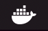

# Deploying your JS/Mongodb App to Docker
##Step 1 - Install Docker
• Head over to ```https://docs.docker.com/docker-for-mac/install/```

• Click
`Download from Docker Hub`

• Create a login

• Click `get docker` 

• Once `Docker` is downloaded, drag it into the `Applications`

• You should see this icon appearing on the top right of your screen 

``` 
// terminal
=> docker version

Client:
 Version:	18.03.0-ce
 API version:	1.37
 Go version:	go1.9.4
 Git commit:	0520e24
 Built:	Wed Mar 21 23:06:22 2018
 OS/Arch:	darwin/amd64
 Experimental:	false
 Orchestrator:	swarm

Server: Docker Engine - Community
 Engine:
  Version:	18.09.2
  API version:	1.39 (minimum version 1.12)
  Go version:	go1.10.6
  Git commit:	6247962
  Built:	Sun Feb 10 04:13:06 2019
  OS/Arch:	linux/amd64
  Experimental:	false
```
## Step 2 - Creating a Docker Image
• In same level as package.json `touch Dockerfile`

```
└── services   
    └── app-directory
       ├── README.md
       ├── node_modules
       ├── package-lock.json
       ├── package.json
       ├── public
       ├── readme
       ├── src
       └── Dockerfile
    
```

```
#Dockerfile
# start with the base image of node, which docker 
will pull from docker hub
FROM node:8

# setting the container working directory
WORKDIR /usr/src/<app-name/

# copying all current files from host to container
COPY . .

# executes as part of build command
RUN npm install

# exposing the port 
EXPOSE 3000

# run this command 
CMD [ "npm", "start" ]
```

• You can then build the image by running: 
` docker build -t <your-docker-username>/<app-name> .`
(Don't forget the ".")

• `docker images` to list your images

## Step 3 - Multple Containers

• Touch a file `docker-compose.yml` in level above. 

```
└── services
    ├── docker-compose.yml
    ├── app-directory
        ├── Dockerfile
        ├── README.md
        ├── client
        ├── node_modules
        ├── package-lock.json
        ├── package.json
        ├── server
        └── webpack.config.js
```
```
#docker-compose.yml
version: '3.1'

# These are all the containers that will be running
services:
  app_name_service:
    container_name: 'app_name_service'
    ports:
      - 3000:3000
    build: ./app_name_service/
    links:
       - mongoservice
    restart: on-failure

  mongoservice:
    image: mongo:latest # pulls down the mongo image
    container_name: "mongoservice"
    environment:
      - MONGO_DATA_DIR=/data/db
      - MONGO_LOG_DIR=/dev/null
    volumes:
     - ./data/db:/data/db
    ports:
      - 27017:27017
    command: mongod --smallfiles
    restart: on-failure
```
• Change
```
// server.js
MongoClient.connect('mongodb://localhost:27017')
```
• To 
```
// server.js
MongoClient.connect('mongodb://mongoservice:27017')
```

## Docker-compose Build / Run

• `docker-compose build` now builds the images by going through our services to builds them accordingly.

• `docker-compose up` will run all the containers.

• You should be able to view the app at `localhost:3000`.


## Step 4 - Seeding your Database
Add the following to your yml file.

```
# docker-compose.yml
mongosetup:
    image: mongo:latest
    container_name: "mongosetup"
    volumes:
     - ./app-name_service/server/db:/seeds # this is route to your seeds file
     - ./mongosetup:/mongosetup
    command: sh /mongosetup/setup.sh
    restart: on-failure
    links:
      - mongoservice
```
• mkdir `mongosetup` in same level as `docker-compose.yml` 

### Make a Script 
• touch `setup.sh` and paste `mongo --host mongoservice:27017 < /seeds/seeds.js`

(This is equivalent to running ` mongo < seeds.js ` to seed your db on your host machine.)

```
# terminal 
chmod -x mongosetup/setup.sh
```
To initialize script. 

• `docker-compose build` to rebuild images
• `docker-compose run` to run containers.

## Step 5 - Stopping Containers
• Check which containers are running with `docker ps`

• Check even stopped containers with `docker ps -a`

• Stop container `docker stop <container-name>`

• Remove container `docker rm <container-name>` 
 


